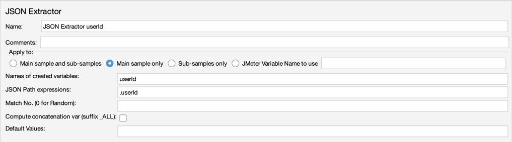
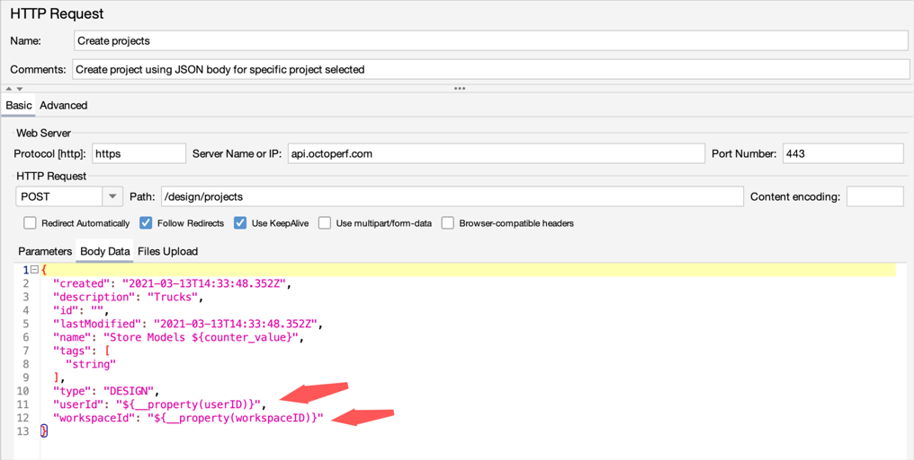
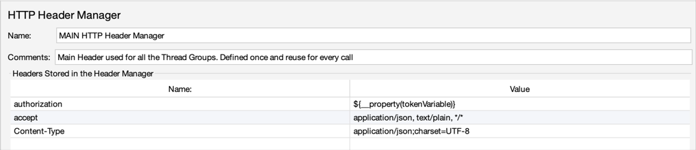
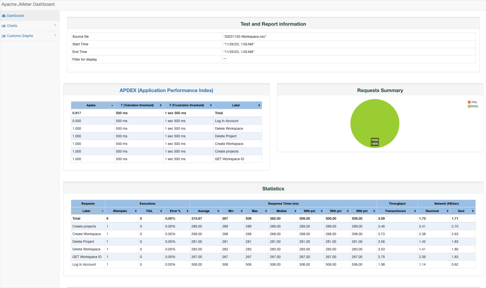

# JMeter Maven Plugin Configuration

This repository demonstrates how to configure the JMeter Maven Plugin to run JMeter tests as part of a Maven build process. The `pom.xml` file contains the necessary configurations for JMeter test execution, result checking, and HTML report generation.

## Usage

Follow these steps to integrate JMeter tests into your Maven project:

1. **Clone the Repository:**

    ```bash
    git clone https://github.com/yourusername/your-repository.git
    cd your-repository
    ```

2. **Update `pom.xml`:**

   Edit the `pom.xml` file to include the JMeter Maven Plugin configuration:

    ```xml
    <!-- Your existing plugin configuration here -->

    <!-- Additional plugins and configurations -->
    <dependencies>
        <!-- Add any additional dependencies here -->
    </dependencies>

    <build>
        <plugins>
            <!-- JMeter Maven Plugin -->
            <plugin>
                <groupId>com.lazerycode.jmeter</groupId>
                <artifactId>jmeter-maven-plugin</artifactId>
                <version>3.8.0</version>
                <executions>
                    <!-- Generate JMeter configuration -->
                    <execution>
                        <id>configuration</id>
                        <goals>
                            <goal>configure</goal>
                        </goals>
                    </execution>
                    <!-- Run JMeter tests -->
                    <execution>
                        <id>jmeter-tests</id>
                        <goals>
                            <goal>jmeter</goal>
                        </goals>
                    </execution>
                    <!-- Fail build on errors in test -->
                    <execution>
                        <id>jmeter-check-results</id>
                        <goals>
                            <goal>results</goal>
                        </goals>
                    </execution>
                </executions>
                <configuration>
                    <testFilesIncluded>
                        <jMeterTestFile>Workspace.jmx</jMeterTestFile>
                    </testFilesIncluded>
                    <generateReports>true</generateReports>
                </configuration>
            </plugin>
        </plugins>
    </build>
    ```

   Update `<jMeterTestFile>` with the actual name of your JMeter test file.

3. **Run Maven:**

   Execute the following command to run the JMeter tests and generate reports:

    ```bash
    mvn clean verify
    ```

4. **View Reports:**

   After a successful build, open the generated HTML reports located in the `target/jmeter-reports` directory.

## JMeter Components

### JSON Extractor

The JSON Extractor is a JMeter post processor that allows you to extract data from JSON responses and store it for later use in your test plan.

Example:


### Beanshell PostProcessor

The Beanshell PostProcessor is a scripting post processor that enables you to perform custom actions on sampler responses using Beanshell scripting.

Example to save Variable.

```bash
${__setProperty(userId,${userId})}
${__setProperty(workspaceId,${workspaceId})}
```
How to use the variables in Threads.


### HTTP Header Manager

The HTTP Header Manager is a JMeter configuration element that allows you to add or modify HTTP request headers for your samplers.

Example:

### Results Tree

The Results Tree is a JMeter listener that provides a tree-like structure to view and analyze the results of your test plan. It shows details such as response times, assertions, and more.

### HTML Reports
Example for HTML report under /target/jmeter/reports


## CI/CD Integration

This Maven project can be easily integrated into Jenkins or any other CI/CD system. Configure your CI/CD pipeline to execute the Maven build commands, and the JMeter tests will be run as part of the automated build and deployment process.

### Jenkins Integration

1. Install the necessary plugins in Jenkins, such as the Maven Plugin.
2. Create a new Jenkins job and configure it to use the Maven project.
3. Add build steps to execute Maven goals, e.g., `clean verify`.
4. Trigger the Jenkins job as part of your CI/CD pipeline.

Adjust the Jenkins job configuration based on your project's requirements.

## Notes

- Ensure that you have a compatible version of Maven installed (at least version 3.9.0).
- Customize the JMeter test file name and additional configurations in the `pom.xml` file based on your project requirements.


